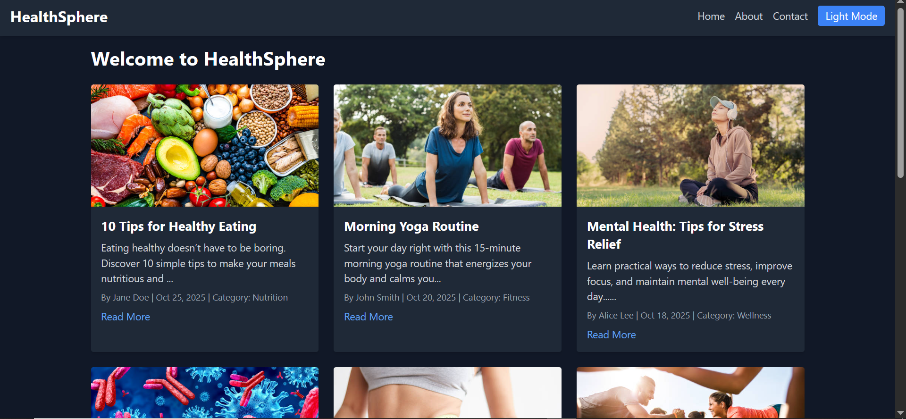

# HealthSphere

**HealthSphere** is a responsive health blog web application built with **React.js**, **Tailwind CSS**, and **React Router**. The app displays articles on various health topics, including nutrition, fitness, mental health, immunity, diet, exercise, lifestyle, and wellness. Users can view a summary of articles on the home page and click each article to read the full content. The application supports **dark mode and light mode** toggling and includes a **task manager** feature for managing daily health tasks.

---

## Table of Contents

- [Features](#features)  
- [Technologies](#technologies)  
- [Getting Started](#getting-started)  
- [Project Structure](#project-structure)  
- [Available Scripts](#available-scripts)  
- [Future Enhancements](#future-enhancements)  
- [License](#license)  

---

## Features

- Responsive and mobile-friendly layout  
- Dark mode / light mode toggle  
- Display articles by category  
- Clickable articles to view full content  
- Uniform card layout for all articles  
- Fully functional routing with React Router  
- Task manager to add, complete, delete, and filter health tasks  
- Footer with copyright and contact email  
- Mock posts for multiple health categories  

---

## Technologies

- **React.js** – Front-end library for building UI components  
- **Tailwind CSS** – Utility-first CSS framework for styling  
- **React Router** – For page navigation  
- **Vite** – Build tool and development server  
- **JavaScript (ES6+)**  

---

## Getting Started

### Prerequisites

- Node.js v18 or higher  
- npm (comes with Node.js)  
- Modern web browser (Chrome, Firefox, Edge, etc.)  

## Screenshots 

[Tasks Screenshot](src/assets/Screenshot_tasks.png)
[About Screenshot](src/assets/Screenshot_about.png)
[Contact & Footer Screenshot](src/assets/Screenshot_contact.png)

## Live Deployment

You can view the live version of this project on Vercel:

🔗 [react-ui-mastering on Vercel] https://react-ui-mastering.vercel.app/

## Future Enhancements

* Add Node.js backend to serve posts from a database
* Implement category-based filtering
* Add user authentication and commenting system
* Add search functionality for articles
* Deploy full-stack version on Vercel / Heroku

---

## License

This project is open-source and available under the [MIT License](LICENSE).
